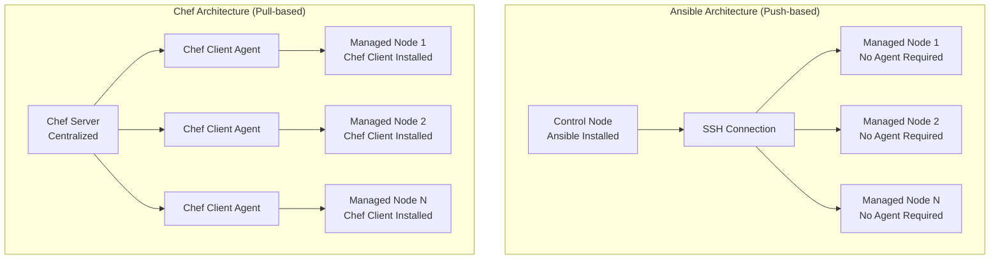
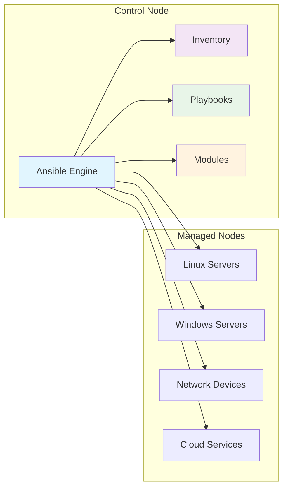
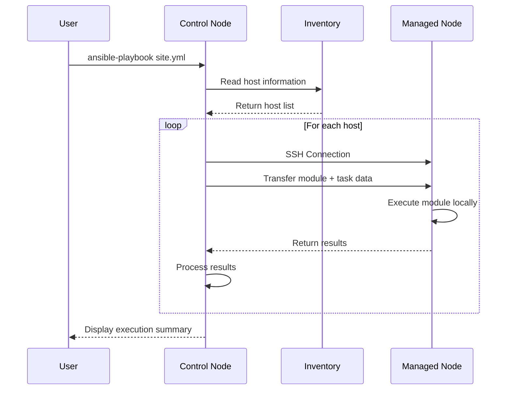
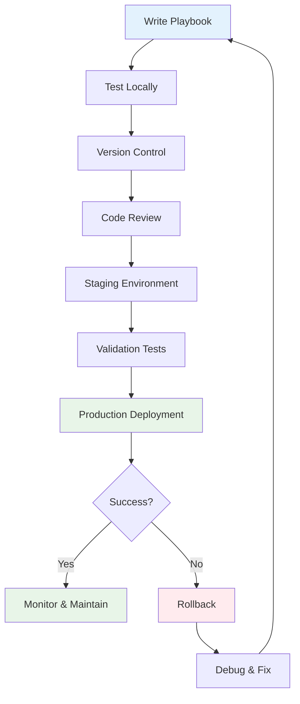
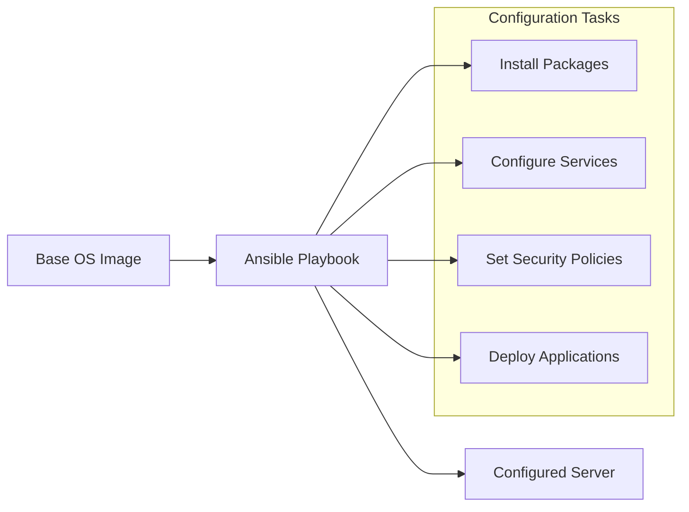

# Ansible: A Comprehensive Guide

## Table of Contents
1. [Introduction to Ansible](#introduction-to-ansible)
2. [Ansible vs Chef: Key Differences](#ansible-vs-chef-key-differences)
3. [Ansible Architecture](#ansible-architecture)
4. [Core Components](#core-components)
5. [How Ansible Works](#how-ansible-works)
6. [Ansible Workflow](#ansible-workflow)
7. [Key Features](#key-features)
8. [Use Cases](#use-cases)
9. [Getting Started](#getting-started)

---

## Introduction to Ansible

**Ansible** is an open-source automation tool developed by Red Hat that simplifies IT automation, configuration management, application deployment, and orchestration. It's designed to be simple, powerful, and agentless, making it one of the most popular choices for DevOps teams worldwide.

### What Makes Ansible Special?

```
┌─────────────────────────────────────────────────────────────┐
│                    ANSIBLE PHILOSOPHY                       │
├─────────────────────────────────────────────────────────────┤
│  Simple    │  Powerful   │  Agentless  │  Human Readable   │
├─────────────────────────────────────────────────────────────┤
│ Easy to     │ Handles     │ No agents   │ YAML-based        │
│ learn and   │ complex     │ to install  │ playbooks that   │
│ use         │ deployments │ or manage   │ anyone can read   │
└─────────────────────────────────────────────────────────────┘
```

---

## Ansible vs Chef: Key Differences

Understanding how Ansible differs from Chef is crucial for making informed decisions about configuration management tools.

### Architecture Comparison



### Detailed Comparison Table

| Aspect | Ansible | Chef |
|--------|---------|------|
| **Architecture** | Push-based, agentless | Pull-based, agent-required |
| **Communication** | SSH/WinRM | Chef client pulls from server |
| **Language** | YAML (declarative) | Ruby DSL (procedural) |
| **Learning Curve** | Gentle, easy to start | Steeper, requires Ruby knowledge |
| **Installation** | Control node only | Server + client on all nodes |
| **Execution Model** | Sequential, ordered | Convergent, idempotent |
| **Scalability** | Good for medium scale | Excellent for large scale |
| **Network Requirements** | Outbound SSH (22) | Inbound HTTPS (443) |
| **Inventory Management** | Static/Dynamic files | Automatic node registration |
| **Debugging** | Verbose output available | Chef logs and reports |

### Why Choose Ansible Over Chef?

```
┌─────────────────────────────────────────────────────────────┐
│                    ANSIBLE ADVANTAGES                       │
├─────────────────────────────────────────────────────────────┤
│ ✓ No Agent Installation    │ ✓ Immediate Results           │
│ ✓ Human-Readable YAML      │ ✓ Lower Learning Curve        │
│ ✓ Simpler Architecture     │ ✓ Better for Ad-hoc Tasks     │
│ ✓ Less Network Overhead    │ ✓ Easier Troubleshooting      │
└─────────────────────────────────────────────────────────────┘
```

---

## Ansible Architecture

### High-Level Architecture Flow



### Component Breakdown

```
┌─────────────────────────────────────────────────────────────┐
│                   ANSIBLE COMPONENTS                        │
├─────────────────────────────────────────────────────────────┤
│                                                             │
│  Control Node                    Managed Nodes             │
│  ┌─────────────┐                ┌─────────────┐             │
│  │  Ansible    │    SSH/WinRM   │   Target    │             │
│  │  Engine     │ ──────────────►│   Systems   │             │
│  │             │                │             │             │
│  │ ┌─────────┐ │                │ ┌─────────┐ │             │
│  │ │Inventory│ │                │ │   OS    │ │             │
│  │ └─────────┘ │                │ │Services │ │             │
│  │ ┌─────────┐ │                │ │  Apps   │ │             │
│  │ │Playbooks│ │                │ └─────────┘ │             │
│  │ └─────────┘ │                └─────────────┘             │
│  │ ┌─────────┐ │                                            │
│  │ │ Modules │ │                                            │
│  │ └─────────┘ │                                            │
│  └─────────────┘                                            │
└─────────────────────────────────────────────────────────────┘
```

---

## Core Components

### 1. Control Node
The machine where Ansible is installed and from which you run Ansible commands and playbooks.

**Requirements:**
- Python 2.7 or 3.5+
- Linux/Unix system (Windows not supported as control node)
- SSH client

### 2. Managed Nodes
The target systems that Ansible manages.

**Requirements:**
- SSH server (Linux/Unix)
- WinRM (Windows)
- Python 2.6+ or 3.5+ (Linux/Unix)
- PowerShell 3.0+ (Windows)

### 3. Inventory
A file that defines the hosts and groups of hosts that Ansible will manage.

```ini
[webservers]
web1.example.com
web2.example.com

[databases]
db1.example.com
db2.example.com

[production:children]
webservers
databases
```

### 4. Playbooks
YAML files that define the desired state and tasks to be executed.

```yaml
---
- name: Configure web servers
  hosts: webservers
  become: yes
  tasks:
    - name: Install Apache
      yum:
        name: httpd
        state: present
    
    - name: Start Apache service
      service:
        name: httpd
        state: started
        enabled: yes
```

### 5. Modules
Reusable, standalone scripts that perform specific tasks.

**Popular Modules:**
- `yum/apt` - Package management
- `service` - Service management
- `copy` - File operations
- `template` - Template processing
- `shell/command` - Command execution

---

## How Ansible Works

### Execution Flow



### Step-by-Step Process

```
┌─────────────────────────────────────────────────────────────┐
│                  ANSIBLE EXECUTION PROCESS                  │
├─────────────────────────────────────────────────────────────┤
│                                                             │
│  1. Parse Playbook     │  6. Execute Module                 │
│     ↓                  │     ↓                              │
│  2. Read Inventory     │  7. Return Results                 │
│     ↓                  │     ↓                              │
│  3. Establish SSH      │  8. Process Output                 │
│     ↓                  │     ↓                              │
│  4. Transfer Module    │  9. Display Summary                │
│     ↓                  │     ↓                              │
│  5. Generate Python    │ 10. Cleanup Temp Files            │
│                                                             │
└─────────────────────────────────────────────────────────────┘
```

---

## Ansible Workflow

### Development to Production Pipeline



### Task Execution Lifecycle

```
┌─────────────────────────────────────────────────────────────┐
│                   TASK LIFECYCLE                            │
├─────────────────────────────────────────────────────────────┤
│                                                             │
│    ┌──────────┐    ┌──────────┐    ┌──────────┐            │
│    │   TASK   │    │  CHECK   │    │ EXECUTE  │            │
│    │  GATHER  │───►│   MODE   │───►│   TASK   │            │
│    │  FACTS   │    │ (DRY RUN)│    │          │            │
│    └──────────┘    └──────────┘    └──────────┘            │
│         │                │               │                 │
│         │                │               ▼                 │
│         │                │         ┌──────────┐            │
│         │                │         │ REPORT   │            │
│         │                └────────►│ CHANGES  │            │
│         │                          │          │            │
│         └─────────────────────────►│ (WHAT IF)│            │
│                                    └──────────┘            │
│                                                             │
└─────────────────────────────────────────────────────────────┘
```

---

## Key Features

### 1. Idempotency
Ansible ensures that running the same playbook multiple times produces the same result.

```yaml
# This task is idempotent
- name: Ensure Apache is installed
  yum:
    name: httpd
    state: present  # Will only install if not already present
```

### 2. Declarative Language
You describe the desired state, not the steps to achieve it.

```yaml
# Declarative approach
- name: Ensure user exists
  user:
    name: john
    state: present
    shell: /bin/bash
    home: /home/john
```

### 3. Agentless Architecture

```
Traditional Tools          vs          Ansible
┌─────────────────┐                   ┌─────────────────┐
│   Server A      │                   │   Server A      │
│ ┌─────────────┐ │                   │                 │
│ │   Agent     │ │                   │   SSH Server    │
│ │ (Resource   │ │                   │   (Built-in)    │
│ │ Consumer)   │ │                   │                 │
│ └─────────────┘ │                   └─────────────────┘
└─────────────────┘                           ▲
         ▲                                     │
         │                               ┌─────────────────┐
┌─────────────────┐                     │  Control Node   │
│  Central Server │                     │    (Ansible)    │
│   (Resource     │                     │                 │
│   Required)     │                     └─────────────────┘
└─────────────────┘
```

### 4. Human-Readable Automation

```yaml
---
- name: Deploy web application
  hosts: webservers
  become: yes
  
  tasks:
    - name: Install required packages
      package:
        name: "{{ item }}"
        state: present
      loop:
        - nginx
        - git
        - python3-pip
    
    - name: Clone application repository
      git:
        repo: https://github.com/company/webapp.git
        dest: /var/www/html
        version: main
    
    - name: Start and enable nginx
      service:
        name: nginx
        state: started
        enabled: yes
```

---

## Use Cases

### 1. Configuration Management



### 2. Application Deployment

```
┌─────────────────────────────────────────────────────────────┐
│                APPLICATION DEPLOYMENT FLOW                  │
├─────────────────────────────────────────────────────────────┤
│                                                             │
│  Development  │   Staging    │  Production                  │
│      ▼        │      ▼       │      ▼                       │
│ ┌─────────┐   │ ┌─────────┐  │ ┌─────────┐                  │
│ │ Deploy  │   │ │ Deploy  │  │ │ Deploy  │                  │
│ │ Code    │──►│ │ & Test  │─►│ │ Live    │                  │
│ └─────────┘   │ └─────────┘  │ └─────────┘                  │
│               │              │                              │
│     Same Ansible Playbook Used Across All Environments     │
│                                                             │
└─────────────────────────────────────────────────────────────┘
```

### 3. Infrastructure Orchestration

```yaml
---
- name: Orchestrate multi-tier application
  hosts: localhost
  tasks:
    - name: Provision load balancer
      include: lb-setup.yml
    
    - name: Setup web tier
      include: web-tier.yml
    
    - name: Configure database cluster
      include: db-cluster.yml
    
    - name: Deploy application
      include: app-deploy.yml
```

### 4. Cloud Automation

```
┌─────────────────────────────────────────────────────────────┐
│                     CLOUD AUTOMATION                        │
├─────────────────────────────────────────────────────────────┤
│                                                             │
│   AWS         │   Azure      │   GCP        │   OpenStack  │
│ ┌─────────┐   │ ┌─────────┐  │ ┌─────────┐  │ ┌─────────┐  │
│ │   EC2   │   │ │   VMs   │  │ │ Compute │  │ │  Nova   │  │
│ │   RDS   │   │ │  SQL DB │  │ │ Cloud   │  │ │ Neutron │  │
│ │   ELB   │   │ │Load Bal │  │ │SQL/BigQ │  │ │ Cinder  │  │
│ │   S3    │   │ │ Storage │  │ │ Storage │  │ │ Swift   │  │
│ └─────────┘   │ └─────────┘  │ └─────────┘  │ └─────────┘  │
│       ▲       │       ▲      │       ▲      │       ▲      │
│       └───────┼───────┼──────┼───────┼──────┼───────┘      │
│               │       │      │       │      │              │
│               └───────┼──────┼───────┼──────┘              │
│                       │      │       │                     │
│                   ┌─────────────────────────┐               │
│                   │    Ansible Engine       │               │
│                   │  (Cloud Modules)        │               │
│                   └─────────────────────────┘               │
└─────────────────────────────────────────────────────────────┘
```

---

## Getting Started

### Installation

```bash
# Install Ansible on control node
pip install ansible

# Verify installation
ansible --version
```

### Basic Commands

```bash
# Check connectivity to all hosts
ansible all -m ping

# Run ad-hoc command
ansible webservers -m shell -a "uptime"

# Execute playbook
ansible-playbook site.yml

# Check what changes would be made (dry run)
ansible-playbook site.yml --check

# Run with increased verbosity
ansible-playbook site.yml -vvv
```

### Project Structure

```
ansible-project/
├── inventory/
│   ├── production
│   └── staging
├── group_vars/
│   ├── all.yml
│   └── webservers.yml
├── host_vars/
│   └── db1.example.com.yml
├── roles/
│   ├── common/
│   ├── webserver/
│   └── database/
├── site.yml
├── webservers.yml
└── databases.yml
```

---

## Conclusion

Ansible represents a paradigm shift in automation and configuration management, offering:

- **Simplicity**: Easy to learn and implement
- **Agentless**: No infrastructure overhead
- **Powerful**: Handles complex scenarios
- **Flexible**: Works across diverse environments
- **Scalable**: Grows with your infrastructure

Whether you're managing a handful of servers or orchestrating complex cloud deployments, Ansible provides the tools and flexibility needed to automate your infrastructure efficiently and reliably.

---

*This guide provides a comprehensive introduction to Ansible. For more detailed information, refer to the [official Ansible documentation](https://docs.ansible.com/).*